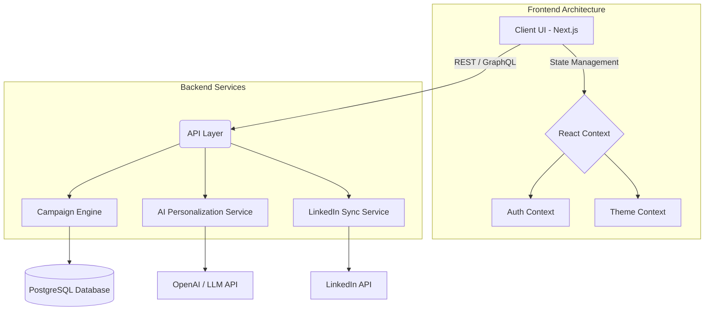

<div align="center">
  
  
  # 🚀 360Airo - Enterprise Outbound Automation
  
  **Supercharge your outreach sequences with context-aware AI, smart deliverability, and omnichannel engagement.**
  
  [](https://nextjs.org/)
  [](https://reactjs.org/)
  [](https://tailwindcss.com/)
  [](https://www.framer.com/motion/)
  [](https://www.typescriptlang.org/)
</div>

<br />

## 🎯 Problem Statement
In the modern B2B sales environment, generic cold outreach is dead. Sales teams struggle with:
- **Poor Deliverability:** Emails landing in spam folders due to low domain reputation.
- **Low Engagement:** Generic, non-personalized emails failing to capture prospect attention.
- **Fragmented Workflows:** Managing email sequences, LinkedIn outreach, and CRM pipelines across multiple disconnected tools.
- **Lack of Actionable Data:** Inability to track real-time open rates, click rates, and prospect intent signals effectively.

## 💡 The Solution: 360Airo
**360Airo** is a unified, AI-driven outbound automation platform designed to solve the modern outreach crisis. It combines smart email warmup, AI-personalized sequencing, omnichannel LinkedIn integration, and a master inbox into a single, beautifully designed dashboard.

With 360Airo, growth teams can scale their outreach infinitely while maintaining the hyper-personalized touch of a 1-on-1 conversation.

---

## 🏗️ System Architecture



---

## 🌊 Application Flow

1. **Onboarding & Auth:** Users securely log in and connect their email domains.
2. **Deliverability Guard (Warmup):** Connected domains enter the automated warmup pool to build reputation.
3. **Prospect Ingestion:** Users import leads (CSV or CRM integration) into the "Email Lists" module.
4. **Campaign Creation:** 
   - Select manual or **AI-driven** generation.
   - AI analyzes prospect data and generates hyper-personalized email sequences.
5. **Omnichannel Execution:** The engine executes the campaign, syncing LinkedIn touches (visits, connection requests) with email steps.
6. **Master Inbox & Pipeline:** All prospect replies route to the Master Inbox. Positive intent signals automatically move leads to the Kanban Pipeline for closing.

---

## 🛠️ Tech Stack

### Frontend & UI
- **Framework:** Next.js (App Router, Turbopack)
- **Library:** React 18
- **Styling:** Tailwind CSS (Custom Design System, Dark Mode)
- **Animations:** Framer Motion (Spring Physics, Layout Animations)
- **Charts:** Recharts
- **Icons:** Lucide React & React Icons

### Core Features Built
- 📊 **Dynamic Dashboards:** Interactive metric cards and real-time activity feeds.
- 🎨 **Premium UI/UX:** Glassmorphism, 3D tilt cards, advanced hover states, and staggered micro-animations.
- 🌓 **Theme Management:** Fully responsive Light/Dark mode implementation.
- 📱 **Responsive Layout:** Sidebar toggling, mobile-first design considerations.
- ⚙️ **CRUD Interfaces:** Robust state management for Pipeline Kanban boards, Campaign tables, and Inbox messages.

---

## 🚀 Getting Started

### Prerequisites
- Node.js (v18+)
- npm or pnpm

### Installation

1. Clone the repository:
   ```bash
   git clone https://github.com/ayush-ranjan9135/360Airo.git
   cd 360Airo
   ```

2. Install dependencies:
   ```bash
   npm install
   ```

3. Run the development server:
   ```bash
   npm run dev
   ```

4. Open [http://localhost:3000](http://localhost:3000) with your browser to see the result.

---

## 👨‍💻 Let's Connect!

Built with ❤️ by **Ayush Ranjan**

[](https://alpha-portfolio-five.vercel.app/)
[](https://www.linkedin.com/in/ayush-ranjan-9135d3/)
[](https://github.com/ayush-ranjan9135)
[](https://www.instagram.com/ayush.__.srivastava?igsh=dW1zdHFjcTZnenV2)
[](https://www.facebook.com/share/1AhB4q1WeW/)

---
*If you like this project, please consider giving it a ⭐ on GitHub!*
